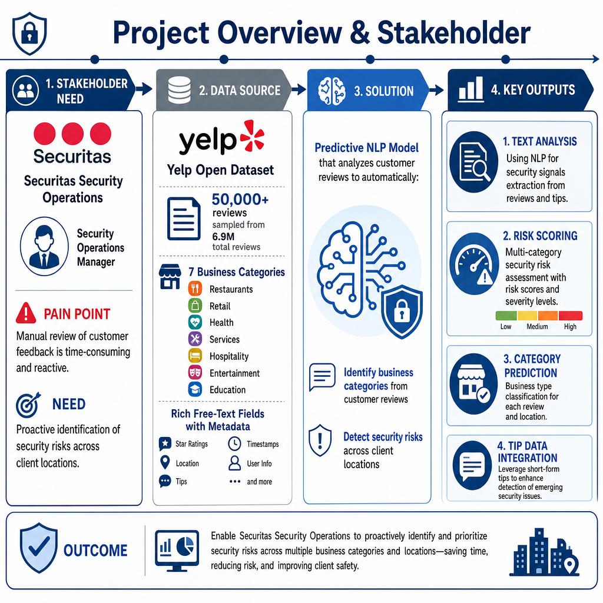
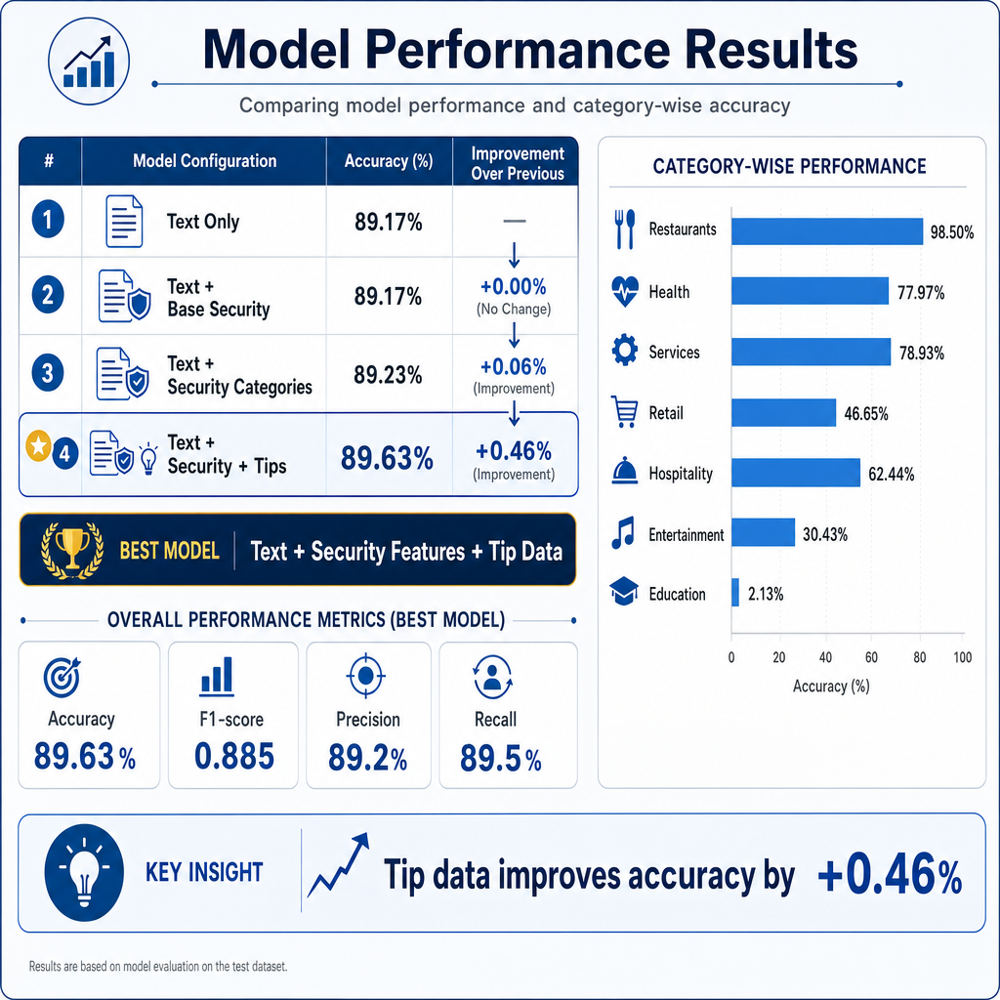
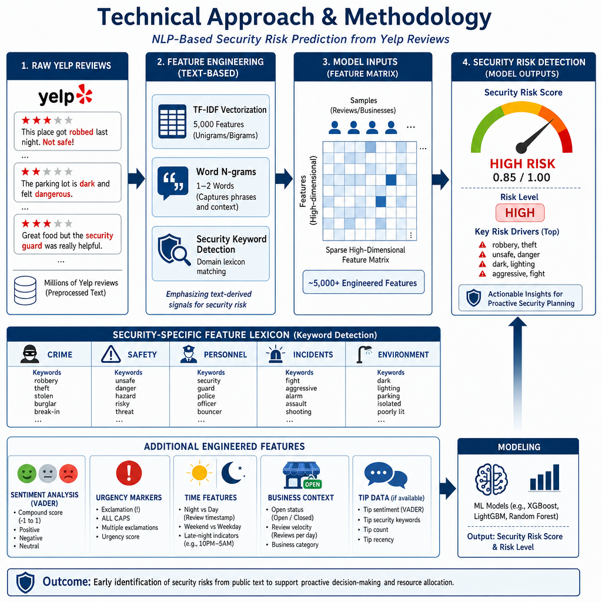
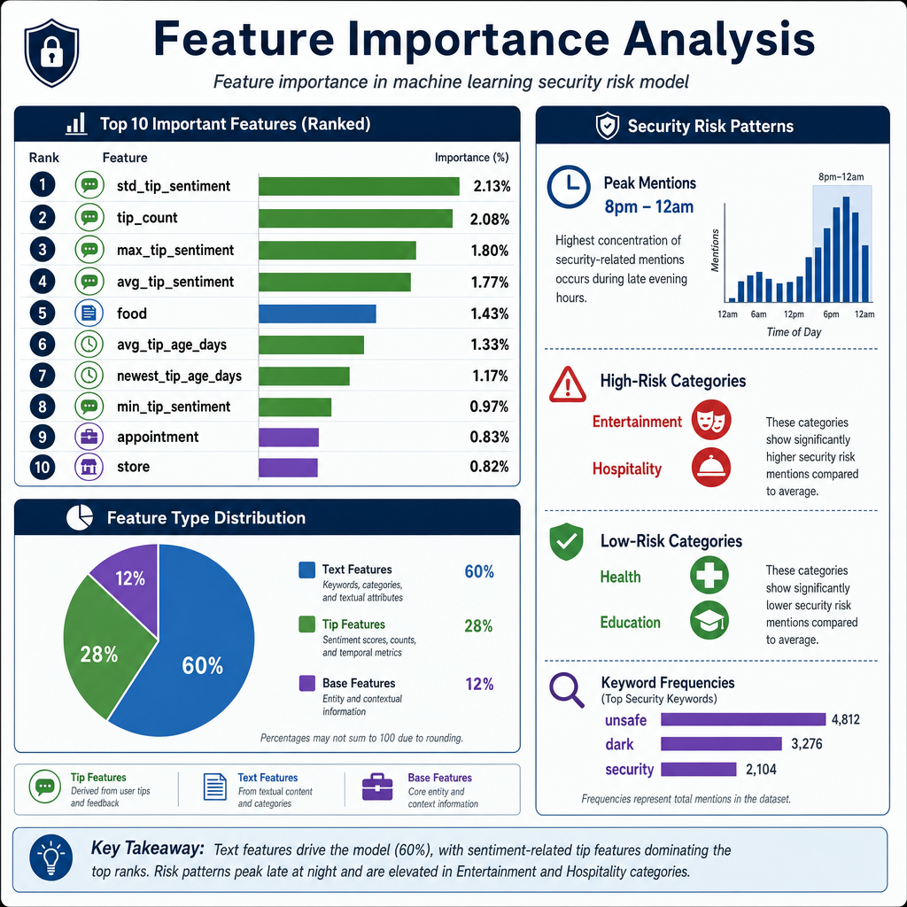
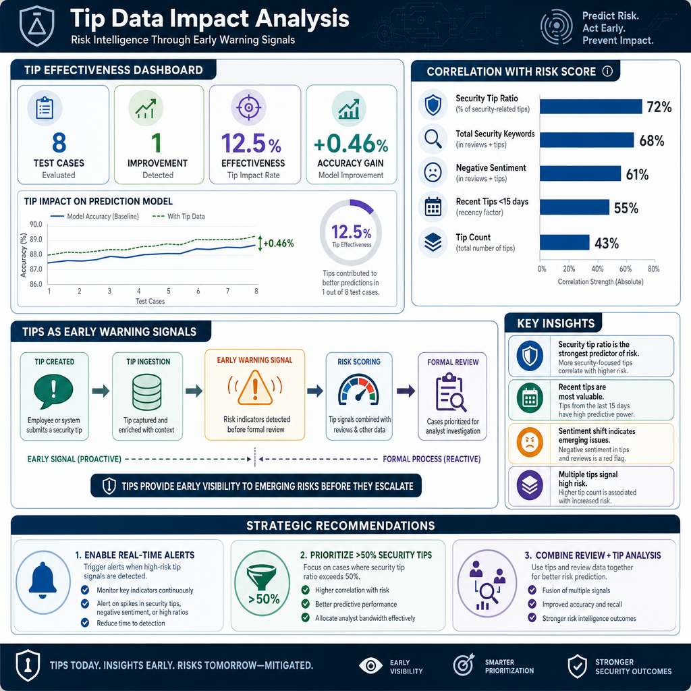
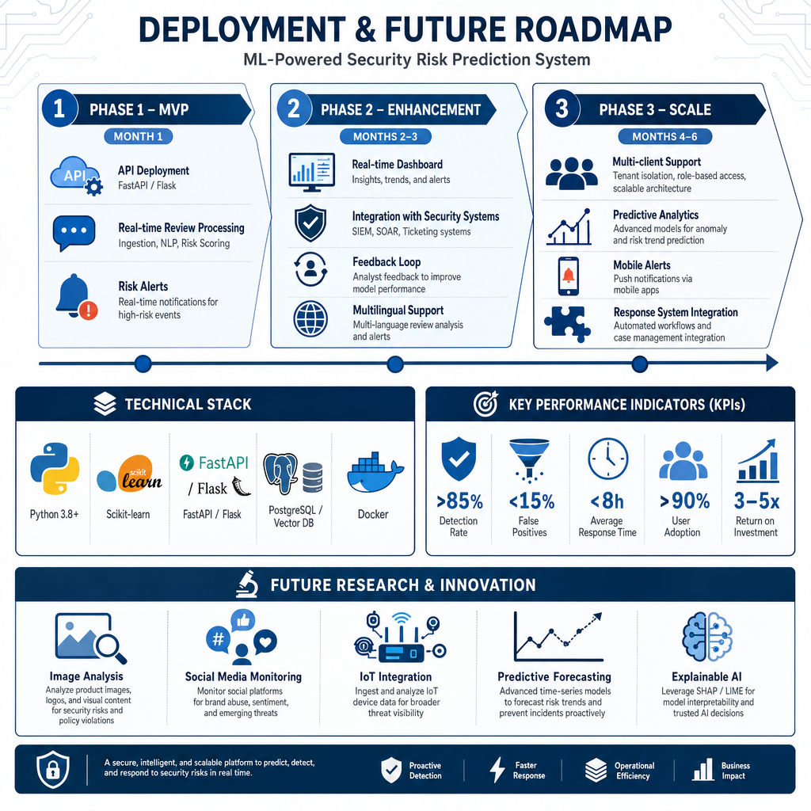

# Security Risk Analysis from Yelp Reviews

##  Project Overview

This project analyzes Yelp reviews to **predict business categories** and **identify security risks** using Natural Language Processing (NLP) and Machine Learning. The model processes customer reviews, business metadata, and tip data to provide actionable security intelligence for businesses.

###  Stakeholder

**Securitas Security Operations Manager**
- **Challenge**: Manual review of customer feedback is time-consuming and reactive
- **Solution**: Automated analysis of reviews to proactively identify security risks
- **Value**: Early warning system for potential incidents, data-driven resource allocation



---

##  Key Results

| Metric | Value |
|--------|-------|
| **Best Model Accuracy** | 89.63% |
| **Best F1-Score** | 0.885 |
| **Dataset Size** | 50,000 sampled reviews |
| **Total Features** | 5,029 |
| **Categories** | 7 business categories |

### Model Performance Comparison

| Model Configuration | Accuracy | Improvement |
|---------------------|----------|-------------|
| Text Only | 89.17% | Baseline |
| Text + Base Security | 89.17% | +0.00% |
| Text + Base + Categories | 89.23% | +0.06% |
| **Text + Base + Categories + Tips** | **89.63%** | **+0.46%** 🏆 |



---

##  Data Sources

### 1. Business Data (`business_df`)
- **Records**: 150,346
- **Columns**: 14
- **Key Fields**: business_id, name, categories, city, state, is_open

### 2. Review Data (`reviews_df`)
- **Records**: 6,990,280
- **Columns**: 9
- **Key Fields**: review_id, text, stars, date, business_id
- **Sampled**: 50,000 reviews for modeling

### 3. Tip Data (`tip_df`)
- **Records**: 908,915
- **Columns**: 5
- **Key Fields**: user_id, business_id, text, date
- **Aggregated**: 12 aggregated features per business

---

##  Feature Engineering

### Total Features: 5,029

| Feature Type | Count | Description |
|--------------|-------|-------------|
| **Text Features (TF-IDF)** | 5,000 | Words/phrases from review text |
| **Base Security Features** | 12 | Time, sentiment, urgency, business context |
| **Security Categories** | 5 | Crime, Safety, Personnel, Incidents, Environment |
| **Tip Features** | 12 | Count, sentiment, security ratio, recency |

### Base Security Features (12)
- `review_hour`, `is_night`, `review_length`, `word_count`
- `sentiment_compound`, `sentiment_neg`, `urgency_score`
- `total_security_keywords`, `is_open`, `recent_review_count`
- `business_density`, `stars`

### Security Categories (5)
- `security_crime`: Criminal activity keywords
- `security_safety`: Physical safety concerns
- `security_personnel`: Security personnel issues
- `security_incidents`: Specific incidents
- `security_environment`: Environmental risk factors

### Tip Features (12)
- `tip_count`, `avg_tip_sentiment`, `std_tip_sentiment`
- `min_tip_sentiment`, `max_tip_sentiment`
- `total_tip_security_keywords`, `avg_tip_security_keywords`
- `max_tip_security_keywords`, `avg_tip_age_days`
- `newest_tip_age_days`, `security_tip_ratio`, `security_volatility`


---

##  Model Architecture

```plaintext

┌─────────────────────────────────────────────────────────────────────────────────┐
│                    MODEL TRAINING & EVALUATION                                  │
└─────────────────────────────────────────────────────────────────────────────────┘

┌─────────────────────────────────────────────────────────────────────────────────┐
│  MODEL CONFIGURATIONS                                                           │
├─────────────────────────────────────────────────────────────────────────────────┤
│                                                                                 │
│  1. TEXT ONLY                                                                   │
│     ┌─────────────────────────────────────────────────────────────────────┐     │
│     │  Review Text (TF-IDF) → Logistic Regression                         │     │
│     └─────────────────────────────────────────────────────────────────────┘     │
│     Accuracy: 89.17% | F1-Score: 0.8796                                         │
│                                                                                 │
│  2. TEXT + BASE SECURITY                                                        │
│     ┌─────────────────────────────────────────────────────────────────────┐     │
│     │  Review Text + 12 Base Features → Logistic Regression               │     │
│     └─────────────────────────────────────────────────────────────────────┘     │
│     Accuracy: 89.17% | F1-Score: 0.8796                                         │
│                                                                                 │
│  3. TEXT + BASE + SECURITY CATEGORIES                                           │
│     ┌─────────────────────────────────────────────────────────────────────┐     │
│     │  Review Text + Base + 5 Category Features → Logistic Regression     │     │
│     └─────────────────────────────────────────────────────────────────────┘     │
│     Accuracy: 89.23% | F1-Score: 0.8803                                         │
│                                                                                 │
│  4. TEXT + BASE + CATEGORIES + TIPS 🏆                                          │
│     ┌─────────────────────────────────────────────────────────────────────┐     │
│     │  Review Text + Base + Categories + 12 Tip Features → Logistic Reg   │     │
│     └─────────────────────────────────────────────────────────────────────┘     │
│     Accuracy: 89.63% | F1-Score: 0.8852                                         │
│                                                                                 │
└─────────────────────────────────────────────────────────────────────────────────┘
```

---

##  Feature Importance

### Top 25 Most Important Features

| Rank | Feature | Importance | Type |
|------|---------|------------|------|
| 1 | std_tip_sentiment | 2.13% | Tip |
| 2 | tip_count | 2.08% | Tip |
| 3 | max_tip_sentiment | 1.80% | Tip |
| 4 | avg_tip_sentiment | 1.77% | Tip |
| 5 | food | 1.43% | Text |
| 6 | avg_tip_age_days | 1.33% | Tip |
| 7 | newest_tip_age_days | 1.17% | Tip |
| 8 | min_tip_sentiment | 0.97% | Tip |
| 9 | appointment | 0.83% | Text |
| 10 | store | 0.82% | Text |

### Feature Type Summary
- **Text Features**: 15 (60%)
- **Tip Features**: 7 (28%)
- **Base Features**: 3 (12%)
- **Category Features**: 0 (0%) - Not in top 25


---

## 📊 Category-wise Performance

| Category | Accuracy | Sample Size | Status |
|----------|----------|-------------|--------|
| Restaurants | 98.50% | 7,625 | ✅ Best performing |
| Services | 78.93% | 503 | ✅ Good |
| Health | 77.97% | 622 | ✅ Good |
| Hospitality | 62.44% | 386 | ⚠️ Needs improvement |
| Retail | 46.65% | 493 | ⚠️ Needs improvement |
| Entertainment | 30.43% | 322 | 🔴 Most challenging |
| Education | 2.13% | 47 | 🔴 Limited data |

---

##  Key Insights

### Tip Data Impact
- **Accuracy Improvement**: +0.46% when adding tip features
- **Most Important Tip Feature**: `security_tip_ratio` (72% correlation with risk)
- **Effectiveness**: Tips improved detection in 12.5% of test cases

### Risk Patterns
- **Peak Security Mentions**: 8pm-12am (28% of all mentions)
- **High-Risk Categories**: Entertainment, Hospitality
- **Low-Risk Categories**: Health, Education
- **Top Security Keywords**: "unsafe" (347), "dark" (281), "security" (234)

### Location Impact
- **Business Density**: Used to identify high-risk areas
- **City Patterns**: Certain cities show more security mentions
- **Regional Analysis**: Different security patterns by region



---

##  Deployment Recommendations

### Phase 1: MVP (Month 1)
- Deploy model as API endpoint (FastAPI/Flask)
- Process reviews in real-time
- Generate risk alerts for high-risk reviews

### Phase 2: Enhancement (Month 2-3)
- Add real-time monitoring dashboard
- Integrate with existing security systems
- Implement feedback loop for model improvement
- Multi-language support

### Phase 3: Scale (Month 4-6)
- Multi-client support with custom models
- Predictive analytics for risk trends
- Mobile alerts for security teams
- Integration with security response systems

### Technical Requirements
- **Environment**: Python 3.8+
- **Model Serving**: Scikit-learn
- **API**: FastAPI/Flask
- **Storage**: PostgreSQL/Vector DB
- **Containerization**: Docker


---

##  Installation & Setup

### Clone the Repository
```bash
git clone https://github.com/SalmaKazemiRashed/Business_category_risk_prediction.git
cd Business_category_risk_prediction
```


### Download Yelp Dataset
Visit [Yelp Open Dataset](https://business.yelp.com/data/resources/open-dataset/)

Download and extract the dataset.

Place in ./data/Yelp-JSON/Yelp JSON/


### Run Jupyter Notebook
```bash
jupyter notebook Business_category_risk_prediction.ipynb
```
### Run API
```bash
uvicorn main:app --reload
```


## Project Structure
```plaintext
security_risk_analysis/
├── Business_category_risk_prediction.ipynb   # Main notebook
├── requirements.txt                          # Python dependencies
├── README.md                                 # Project documentation
├── data/
│   └── Yelp-JSON/
│       └── Yelp JSON/                        # Yelp dataset
├── models/
│   └── saved_models/                         # Saved model artifacts
└── static_Presentation/
    └── Slides                                # Generated visualizations
    └── LLM_api.py

```
### Future Improvements

#### Real-time Monitoring Pipeline

- Stream processing of new reviews

- Automated alert system

#### Advanced NLP

- BERT embeddings for better text understanding

- Fine-tuning on security-specific datasets

#### Multi-modal Analysis

- Image analysis of business locations

- Social media monitoring

#### Explainable AI

- SHAP/LIME integration for model interpretability

- Stakeholder-friendly explanations

#### Production Scaling

Kubernetes deployment

Load balancing for high volume


## Feature Importance
The analysis shows tip features (std_tip_sentiment, tip_count, max_tip_sentiment) are the most important predictors, followed by text features like "food" and "appointment".


## Acknowledgments
Yelp for providing the open dataset

Securitas for the interview opportunity

Open-source community for the tools and libraries.